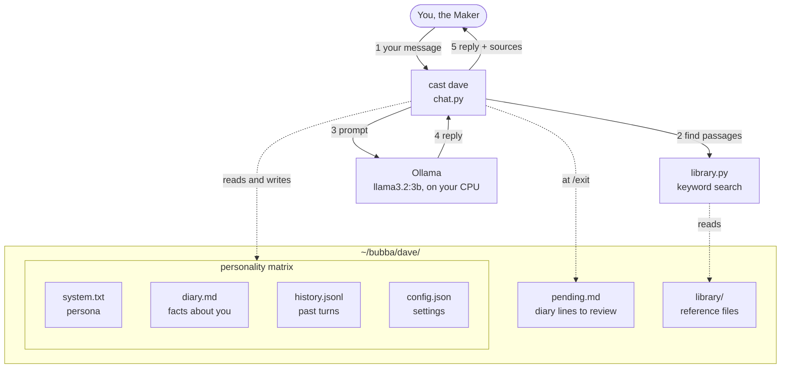
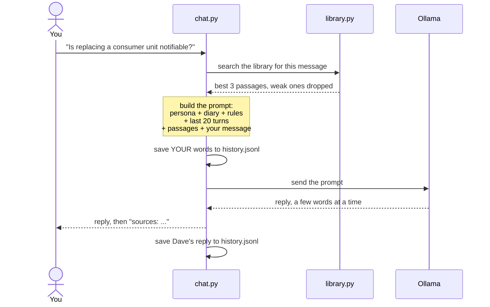
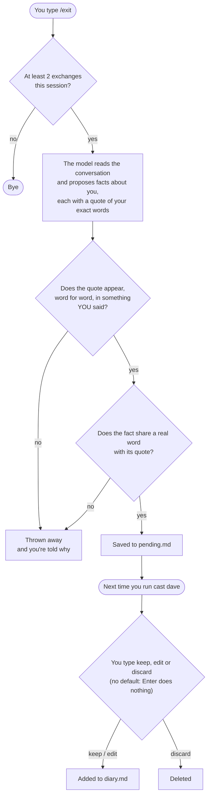
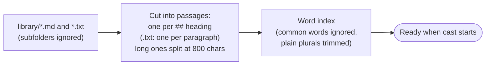

# How localcast works

This is how a character like Dave is put together: what's stored where, what happens to each message, and how the diary stays honest. For installing and using it, see the [README](README.md).

Everything runs on your own machine. localcast is two Python files, `chat.py` and `library.py`, talking to [Ollama](https://ollama.com), which runs the model.

## The big picture

A character is just a folder. Nothing is hidden in a database: every part is a plain file you can open, read and edit.

| File | What it holds | Who writes it |
|---|---|---|
| `system.txt` | Who the character is, in plain English | You |
| `diary.md` | Facts you've told the character, each with your own words | You approve every line |
| `history.jsonl` | Every turn of every conversation, one per line | localcast, automatically |
| `config.json` | Model, temperature, context size, how much history and library to send | You |
| `pending.md` | Proposed diary lines waiting for your review | localcast, at the end of a session |
| `library/` | Reference files: official documents, your notes, local knowledge | You |

The first four are what I call the **personality matrix**: persona, diary, history, config. The library was added later (Level 4).

## What happens to one message

Say you ask Dave *"Is replacing a consumer unit notifiable?"*

Step by step:

1. **Search the library.** `library.py` scores every passage against the words in your message, using BM25, a standard keyword-ranking method. Rare words count for more, so "consumer" matters more than "work". It keeps up to 3 passages. Anything scoring under 40% of the best match is dropped, and so is anything that would push the total over 2,000 characters.
2. **Build the prompt.** It has four layers, in this order:
   - the **persona** from `system.txt`;
   - the **diary**, under a heading that says it's from previous conversations;
   - if there's a library, the **reference rules**: answer from the passages, say where it's from, don't add facts, say "I'd have to check" if the passages don't cover it;
   - the **last 20 turns** of history, then your message, with the passages placed just in front of it.
3. **Save your words.** Only what *you* typed goes into history. The passages never do, so they can't pile up and fill the model's memory.
4. **Ask the model.** Ollama streams the reply back, and you see it appear as it's written.
5. **Show the sources.** The `sources:` line lists the passages Dave was given. `/sources` shows them in full.

The passages go in the last message, not the persona, for two reasons. Small models pay most attention to what's nearest their answer. And the persona, diary and history stay the same from one message to the next, so Ollama can reuse its work on them instead of re-reading everything each time. That matters on a 2015 CPU.

## How the diary stays honest

The diary is where the first version went badly wrong: every line it saved about me was invented. This is how it works now.

The important idea: **the model is never trusted to be careful.** It only *proposes*. Two checks in code decide what survives, and then you decide. Dave's own lines are marked as fiction in the proposal step, and the quote check means a fact can only come from something you actually typed.

You can also skip all of that: `/remember <fact>` writes straight to the diary, and `diary.md` is a plain file you can edit.

## How the library is read

- The library is read fresh **every time you start `cast`**. There's nothing to rebuild: add or change a file, then start a new session.
- Each passage keeps its **file name and heading**, which is what appears in `sources:`. That's why one `##` heading per topic matters.
- The search matches **words, not meaning**. Chat words like "morning", "cheers" and "Dave" are ignored, so small talk rarely pulls in passages, though it still can.
- Dave's library has **80 passages** across five files.

### Why keyword search, and why notes

We measured two alternatives before settling on this:

- **Stemming** (cutting words to their roots) made results worse, 21 → 19 of 27. It merged "notifiable" with "non-notifiable".
- **Searching by meaning** (Ollama embeddings) missed the same questions as keywords did, and needs a second model. The code is still in `library.py` as `EmbeddingLibrary`, but isn't used.

The fix that worked was **plain-English notes**: a short note in everyday words, pointing to the right section of the official document. That took the search to 23 of 27, and all 6 everyday-worded questions. Full results are in [`tests/results/NOTES_RESULTS.md`](tests/results/NOTES_RESULTS.md).

## Where to change things

| To change… | Edit… |
|---|---|
| How a character talks | `~/bubba/<name>/system.txt` |
| What a character knows | add files to `~/bubba/<name>/library/` |
| What it remembers about you | `~/bubba/<name>/diary.md`, or `/remember` |
| The model, or how much history it sees | `~/bubba/<name>/config.json` |
| The reference rules | `LIBRARY_RULES` in `chat.py` |
| The diary proposal and checks | `DIARY_PROMPT` and `check_diary_line()` in `chat.py` |
| How files are split and searched | `split_passages()` and `Library` in `library.py` |

Test and measuring tools are in `tests/`. The results of every before-and-after measurement, with method and raw output, are in `tests/results/`.

## Honest limits of the design

- **It's only as good as a 3B model.** Even with the right passage in front of it, Dave sometimes says the opposite.
- **Keyword search can't know synonyms.** If nobody wrote "rewire" in the library, a rewire question won't find the right passage. The answer is a better note, not a cleverer search.
- **History is cut to the last 20 turns.** Anything older only survives if it made it into the diary.
- **One user, one machine.** There are no accounts. Whoever can run `cast` is "the Maker".
